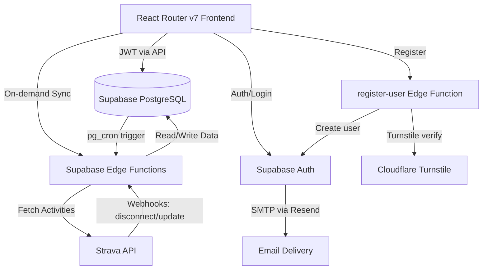
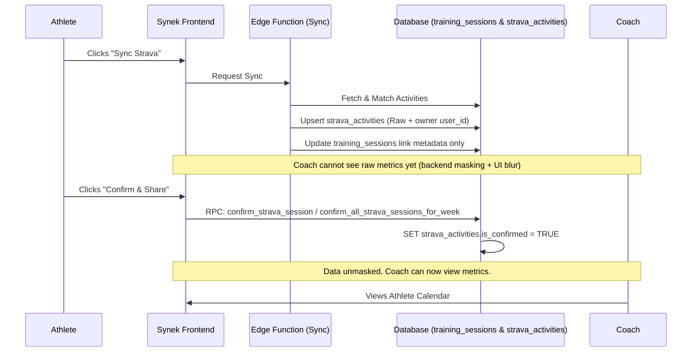

# Synek Architecture Overview

Synek is a coaching and training management platform designed to connect athletes and coaches. The architecture is built to provide real-time updates, secure data boundaries based on user roles, and seamless integrations with third-party fitness platforms like Strava.

## Tech Stack

- **Frontend:** React Router v7 (SPA), React 19, Tailwind CSS, shadcn/ui, Zod 4.
- **Data Fetching/State:** React Query (TanStack Query) for remote state, local storage for some UI preferences.
- **Backend & Database:** Supabase (PostgreSQL), Row Level Security (RLS) for authorization.
- **Auth:** Supabase Auth (email/password + Google OAuth), Cloudflare Turnstile (bot protection), Resend (SMTP).
- **Serverless Compute:** Supabase Edge Functions (Deno) for webhooks, background jobs, and registration.
- **Background Jobs:** `pg_cron` extension in PostgreSQL.

---

## High-Level System Architecture

---

## Authentication & Registration

### Auth Flows

| Flow                   | Route                                | Backend                                            |
| ---------------------- | ------------------------------------ | -------------------------------------------------- |
| Email/password login   | `/login`                             | `supabase.auth.signInWithPassword`                 |
| Google OAuth           | `/login`, `/register`                | `supabase.auth.signInWithOAuth` → `/auth/callback` |
| Registration           | `/register`                          | `register-user` Edge Function → Supabase Admin API |
| Email confirmation     | `/confirm-email` → `/auth/callback`  | `supabase.auth.verifyOtp`                          |
| Password reset request | `/forgot-password`                   | `supabase.auth.resetPasswordForEmail`              |
| Password update        | `/auth/callback` → `/reset-password` | `supabase.auth.updateUser`                         |
| Role selection         | `/select-role`                       | `profiles` table update                            |

### Registration Pipeline (`register-user` Edge Function)

1. **Turnstile verification** — validates Cloudflare captcha token server-side
2. **Rate limiting** — checks `auth_rate_limits` table (IP + email, configurable window)
3. **Duplicate detection** — checks existing users; resends confirmation for unconfirmed accounts
4. **User creation** — `supabase.auth.admin.createUser` with email confirmation required
5. **Confirmation email** — sent via Resend SMTP (configured in Supabase Auth SMTP settings)

### Auth Callback (`/auth/callback`)

Unified handler for all Supabase auth redirects. See `docs/how-to/auth-callback-pattern.md`.

### Email Delivery

- **Provider:** Resend (`smtp.resend.com`)
- **Templates:** Custom HTML in `supabase/templates/` (confirmation, password reset)
- **Logging:** Delivery logs in Resend dashboard (sent/bounced/failed)

### Validation

Client-side form validation uses Zod schemas in `app/lib/schemas/auth.ts` (email, password strength, field matching).

---

## Data Model & Role-Based Security

The core data model relies heavily on Supabase Row Level Security (RLS) to enforce strict boundaries between Athletes and Coaches.

### Core Entities

- `profiles`: Tied directly to `auth.users`. Defines the user's role (`coach` or `athlete`).
- `auth_rate_limits`: Tracks registration attempts by IP and email for rate limiting.
- `coach_athletes`: A junction table managing the invites and active relationships between a coach and multiple athletes.
- `week_plans`: Owned by an `athlete_id`. Contains high-level goals.
- `training_sessions`: The core entity. Belongs to a `week_plan`. Contains planned metrics (from the coach) and actual metrics (from the athlete).

### Security Boundaries

- **Athletes:** Can read/write their own `week_plans` and `training_sessions`.
- **Coaches:** Can only read/write `week_plans` and `training_sessions` for athletes explicitly linked to them via the `coach_athletes` table.

---

## Strava Integration Architecture

To comply with Strava's API terms—specifically regarding data privacy, sharing consent, and data retention—the integration uses `strava_activities.is_confirmed` as the single consent flag and a secure read surface for session data.

### Data Flow

### 1. Synchronization (`strava-sync` Edge Function)

When an athlete clicks "Sync", an Edge Function polls the Strava API for activities matching the current week. It matches Strava activities (e.g., "Morning Run") to planned Synek sessions (e.g., `training_type = 'run'`).

Security model:

- See [`strava-function-security.md`](./strava-function-security.md) for the canonical auth model and required client headers.

The function writes to two tables:

1. `strava_activities`: Stores raw payload + exact metrics + `user_id` owner.
2. `training_sessions`: Updates `strava_activity_id` and `strava_synced_at` only.

### 2. Privacy & Masking (The "Consent" Gateway)

By default, newly synced Strava data is considered _private_ to the athlete.

- **Backend Masking:** The app reads sessions from `secure_training_sessions`. For Strava-linked sessions, this view returns `NULL` for sensitive metrics to coaches until `strava_activities.is_confirmed = TRUE`.
- **Frontend Masking:** The UI applies a blur (`filter: blur(3px)`) and placeholder text (`---`) when masked values are returned.

### 3. Bulk Confirmation RPC

To share data, the athlete must explicitly consent. Clicking the "Confirm & Share" button invokes a secure PostgreSQL RPC: `confirm_all_strava_sessions_for_week`.

- This function runs as `SECURITY INVOKER` to verify the JWT token matches the `athlete_id` of the week plan.
- It updates only `strava_activities.is_confirmed` (single source of truth).

### 4. Background Token Refresh (`strava-token-refresh`)

Strava OAuth tokens expire every 6 hours.

- A `pg_cron` job runs every hour inside PostgreSQL.
- It triggers the `strava-token-refresh` Edge Function via `pg_net`.
- The function finds tokens expiring within 60 minutes and seamlessly refreshes them, preventing the UI from stalling on expired credentials.

### 5. Webhook Data Retention Compliance (`strava-webhook`)

If an athlete revokes access to Synek from their Strava dashboard, Strava fires an `athlete:update` webhook with `authorized: "false"`.

- The `strava-webhook` Edge Function receives this payload.
- It validates both Strava handshake token and callback `verify_token` query secret.
- It hard-deletes `strava_activities` for the revoked user and then deletes the corresponding `strava_tokens` row.
