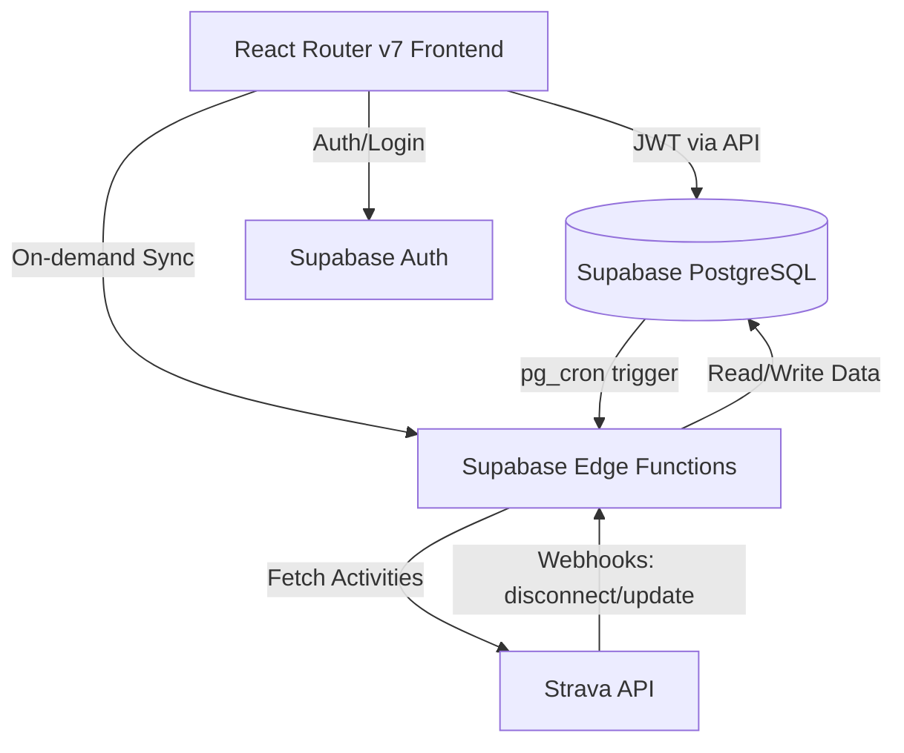
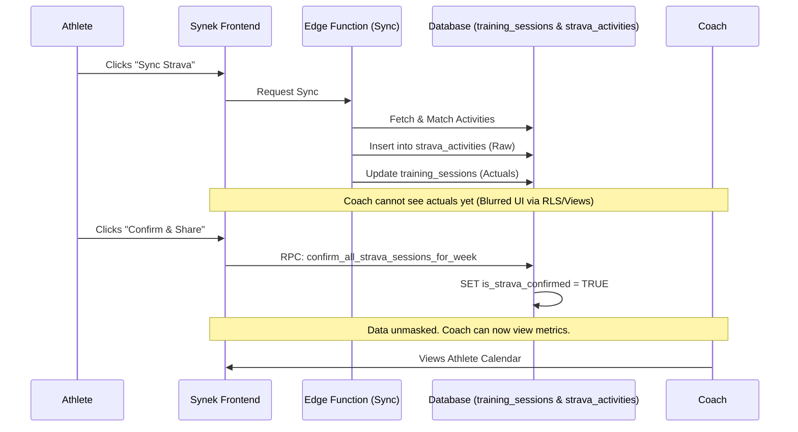

# Synek Architecture Overview

Synek is a coaching and training management platform designed to connect athletes and coaches. The architecture is built to provide real-time updates, secure data boundaries based on user roles, and seamless integrations with third-party fitness platforms like Strava.

## Tech Stack
- **Frontend:** React Router v7 (SSR/SPA), React, Tailwind CSS, shadcn/ui.
- **Data Fetching/State:** React Query (TanStack Query) for remote state, local storage for some UI preferences.
- **Backend & Database:** Supabase (PostgreSQL), Row Level Security (RLS) for authorization.
- **Serverless Compute:** Supabase Edge Functions (Deno) for webhooks and background jobs.
- **Background Jobs:** `pg_cron` extension in PostgreSQL.

---

## High-Level System Architecture

---

## Data Model & Role-Based Security

The core data model relies heavily on Supabase Row Level Security (RLS) to enforce strict boundaries between Athletes and Coaches.

### Core Entities
- `profiles`: Tied directly to `auth.users`. Defines the user's role (`coach` or `athlete`).
- `coach_athletes`: A junction table managing the invites and active relationships between a coach and multiple athletes.
- `week_plans`: Owned by an `athlete_id`. Contains high-level goals.
- `training_sessions`: The core entity. Belongs to a `week_plan`. Contains planned metrics (from the coach) and actual metrics (from the athlete).

### Security Boundaries
- **Athletes:** Can read/write their own `week_plans` and `training_sessions`.
- **Coaches:** Can only read/write `week_plans` and `training_sessions` for athletes explicitly linked to them via the `coach_athletes` table.

---

## Strava Integration Architecture

To comply with Strava's API terms—specifically regarding data privacy, sharing consent, and data retention—the Strava integration uses a dual-table model with a strict manual-sharing gateway.

### Data Flow

### 1. Synchronization (`strava-sync` Edge Function)
When an athlete clicks "Sync", an Edge Function polls the Strava API for activities matching the current week. It applies an algorithm to match Strava activities (e.g., "Morning Run") to planned Synek sessions (e.g., `training_type = 'run'`).

The function writes to two tables:
1. `strava_activities`: Stores the raw JSON payload and exact Strava metrics.
2. `training_sessions`: Updates the `actual_*` columns for the matched session.

### 2. Privacy & Masking (The "Consent" Gateway)
By default, newly synced Strava data is considered *private* to the athlete.
- **Backend Masking:** A secure database view (`secure_strava_activities`) checks the `is_strava_confirmed` flag. If it is `FALSE` and the requester is a Coach, the view returns `NULL` for sensitive metrics (distance, pace, HR).
- **Frontend Masking:** The UI intercepts these `NULL` values and applies a visual blur (`filter: blur(3px)`) with placeholder text (`---`), informing the coach that the data exists but awaits the athlete's consent to share.

### 3. Bulk Confirmation RPC
To share data, the athlete must explicitly consent. Clicking the "Confirm & Share" button invokes a secure PostgreSQL RPC: `confirm_all_strava_sessions_for_week`. 
- This function runs as `SECURITY INVOKER` to verify the JWT token matches the `athlete_id` of the week plan.
- It atomically flips the `is_strava_confirmed` flag to `TRUE` for both the `training_sessions` and `strava_activities` tables.

### 4. Background Token Refresh (`strava-token-refresh`)
Strava OAuth tokens expire every 6 hours.
- A `pg_cron` job runs every hour inside PostgreSQL.
- It triggers the `strava-token-refresh` Edge Function via `pg_net`.
- The function finds tokens expiring within 60 minutes and seamlessly refreshes them, preventing the UI from stalling on expired credentials.

### 5. Webhook Data Retention Compliance (`strava-webhook`)
If an athlete revokes access to Synek from their Strava dashboard, Strava fires an `athlete:update` webhook with `authorized: "false"`.
- The `strava-webhook` Edge Function receives this payload.
- It immediately deletes the user's `strava_tokens` row.
- **Cascade Deletion:** Because `strava_activities.user_id` has an `ON DELETE CASCADE` constraint linked to the user's authorization, deleting the token (and subsequent user link) thoroughly scrubs the revoked Strava data from the system, keeping Synek 100% compliant with Strava's data retention policies.